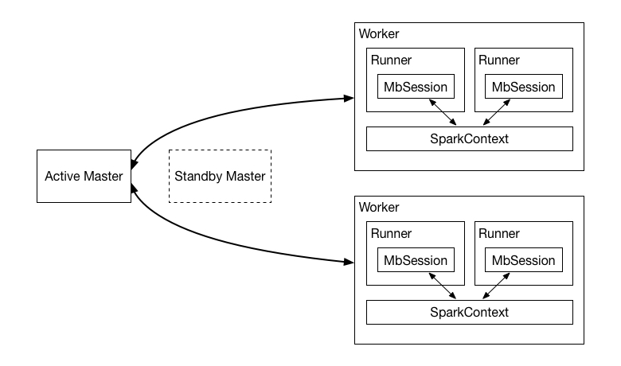

本节主要介绍Moonbox的工作模式,以及涉及到的模块的配置,让大家对Moonbox有个整体的认识。

### 工作模式

Moonbox以master-slave集群模式工作,master支持主备多活。master负责客户端接入,接收查询指令,然后将任务调度到合适的Worker。Worker进程会分局分配的任务类型启动一个新的或者使用已有的Runner。每个Runner持有一个MbSession,MbSession是对SparkSession的封装,额外添加了一些其他的功能,例如用户体系,权限体系,下推优化等。每个Worker进程持有一个常驻的SparkContext,负责正真的计算。

  

### 模块配置

为让Moonbox成功运行,需要配置一些必需和可选的配置项,下面分别介绍各个配置模块的作用。

- jwt
    JWT(Json Web Token)相关配置,更多详细信息请参阅JWT官网。

- login
    用于配置Moonbox登录认证方式,目前支持built-in方式,即为内置用户名密码认证方式。后续会支持其他认证方式。

- port
    用于配置tcp端口绑定失败最大重试次数。

- schedule
    master作业调度相关参数。

- timer
    用于配置定时任务服务,目前仅支持quartz。如需使用quartz Job持久化功能,请修改相应参数,更多信息请参考Configuration章节,或则quartz官方网站。

- rest
    用于配置http server,用于提供restful服务。

- tcp
    用于配置tcp server,用于提供jdbc服务。

- odbc
    用于配置thrift server, 用于提供odbc服务。目前thrift服务和odbc功能尚未开源。

- rpc
    Moonbox Rpc相关配置。

- persist
    用于master运行时数据持久化,目前支持的配置项为NONE和zookeeper。更多信息请参阅Configuration章节。

- catalog
    Moonbox元数据存储位置相关配置。目前仅支持jdbc类型数据源,例如mysql、oracle等。

- cache
    Moonbox用于回显的查询结果储存位置相关配置。目前仅支持redis。

- mixcal
    Moonbox使用的混算引擎相关配置。目前仅支持使用Spark作为混算引擎。