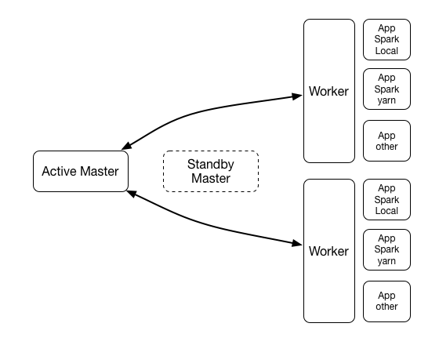

本节主要介绍Moonbox的工作模式,让大家对Moonbox有个整体的认识。

### 工作模式

Moonbox以master-slave集群模式工作, 集群中主要有三种进程,分别为Master、Worker、APP。
- Master

    整个Moonbox集群的主节点, Master分为Active Master和Standby Master, 通过Zookeeper来支持主备切换。
- Worker

    向Master节点注册, 主要负责该节点上各种APP进程的启动和停止。
- APP

    真正进行任务处理的节点, 可以有各种不同的APP节点,例如Spark APP, Hive APP, 或者各种自定义的APP。

  

下面详细介绍Spark APP的工作模式。每个Spark APP拥有一个常驻的SparkContext, 在APP节点启动的时候就进行了初始化。
每当有客户端请求新建一个会话, APP就会创建一个Runner, Runner持有一个MbSession, MbSession会与当前会话进行绑定,
各个MbSession隔离互不影响, 所以多租户之间的操作互不影响。
MbSession是对SparkSession的封装, 额外添加了一些其他的功能, 例如用户体系, 元数据持久化, 权限体系,下推优化等。

  

以APP为Spark APP为例, 当Client向Master发送连接请求时, Master会根据该Client请求的任务类型自动返回一个合适的APP服务地址给Client,将Client重定向连接到APP上。
Client将指令发送给Spark APP, 当用户的操作为DDL类型指令时, MbSession会操作Catalog进行元数据变更。
当用户的操作为查询类指令时, MbSession首先会根据分析当前用户是否拥有查询对象的查询或者写入权限, 进行列级别的权限控制。
然后会进行下推优化, 判断查询中某些算子或者计算逻辑是否能够下推到物理层数据源中进行计算,
如果可以完全下推, 则将查询翻译成数据源对应的查询操作, 直接使用数据源客户端进行查询, 将结果数据返回给客户端。
如果不能完全下推, 则将查询计划中可以下推的部分翻译成数据源对应的查询操作, 然后将作业提交给Spark 运行。
此时会有一部分计算逻辑发生在数据源中, 另外一部分计算逻辑交由Spark来完成。

