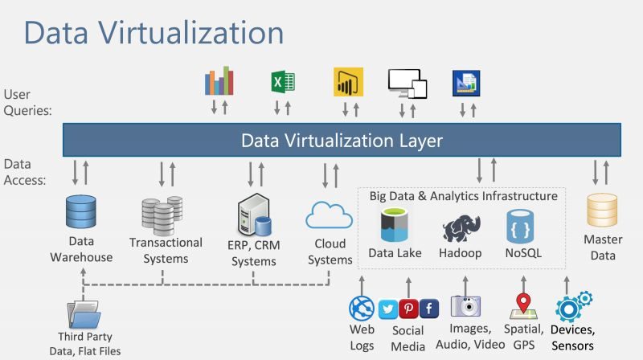
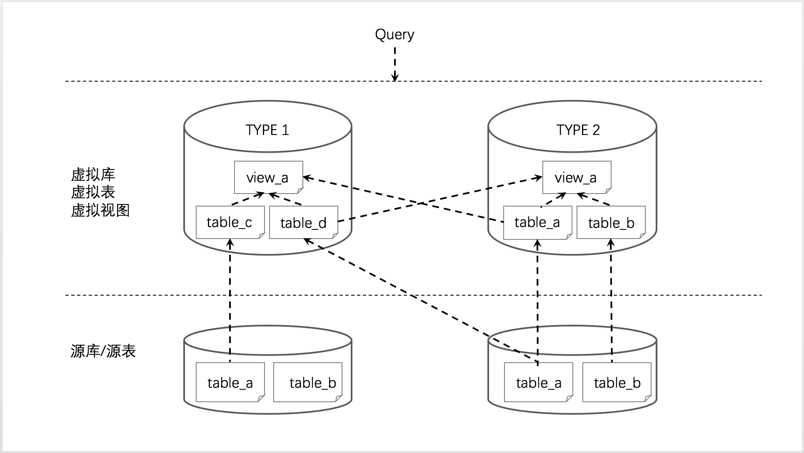
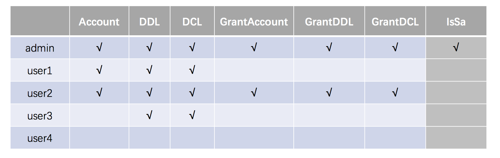

本节主要介绍Moonbox涉及到的一些基本概念,了解这些基本概念有助于理解Moonbox的设计思想和更好的使用Moonbox。

#### 数据虚拟化

数据虚拟化，是指对于用户或用户程序而言，面对的是统一的交互方式和查询语言，而无需关注数据实际所在的物理库和方言及交互方式（异构系统／异构查询语言）的一种技术。用户的使用体验是面对一个单一数据库进行操作，但其实这是一个虚拟化的数据库，数据本身并不存放于虚拟数据库中。

  

  (选自"Designing a Modern Data Warehouse + Data Lake" - Melissa Coates, Solution Architect, BlueGranite)

数据虚拟化软件通常需要具备以下几个能力:
- 透明访问

    以统一的方式和语言访问不同的数据源,而不用关心数据源物理位置和特性。
- 多数据源支持

    需要将数据源的访问形式和查询语言进行抽象,支持多种异构数据源,同时能够很方便的进行扩展。
- 分布式并行计算

    可以以分布式计算方式快速进行跨多异构数据源进行混算。
- 元数据获取

    可以通过统一的方式获取底层数据源的元数据信息。
- 数据安全

    数据安全包括用户登录认证、授权访问、数据加密、操作审计等。认证和授权是针对用户而言的,加密是从数据本身考虑的,审计从系统角度角度出发的。

Moonbox即定位于上图中的Data Virtualization Layer,并提供了如上所述的能力。让我们来了解一下Moonbox中与之相关的概念。

#### 数据源

Moonbox将系统外部数据的来源统一视为数据源,数据源除了可以是hdfs这种纯存储系统，或者mysql、elasticsearch这种带计算能力的存储系统，还可以是presto等计算引擎。

#### 数据映射

   数据映射层实现虚拟表到数据源的映射,从而保证数据虚拟化平台向数据消费者交付正确的数据。同时,数据映射层也屏蔽了底层数据源的物理细节。

  

Moonbox和数据库一样,提供两级命名空间,分别是数据库和表。虚拟库有两种组织方式:TYPE 1和TYPE 2。

- TYPE 1

    此种方式的虚拟库中的虚拟表可以来自不同的源库中的部分源表。此方式类似于Spark SQL中的数据库的组织形式,非常适合按照业务需求将散落在不同的源库中的源表组织到一个虚拟库中。
- TYPE 2

    此种方式的虚拟库中的虚拟表来自同一个源库中的所有源表。此种方式类似于Presto中的schema的组织形式,可以快速将源库映射成Moonbox的虚拟库。

View的概念类似于关系型数据库中的逻辑视图,从属于数据库,view基于虚拟表通过SQL定义创建,view也可以基于view创建出嵌套的view。

#### 用户体系

Moonbox引入了Organization的概念,用于划分用户空间。Moonbox用户大致可以分为三类,分别是ROOT、管理员(Sa)和普通用户(User)。

- ROOT

    系统内置用户,不属于任何Organization。用于创建Organization和在Organization中创建出管理员(Sa)。
- 管理员(Sa)

    由ROOT创建,从属于Organization,一个Organization中可以有一个或者多个Sa。Sa负责管理该Organization中的所有资源,包括创建普通用户并授予其适当的权利。
- 普通用户(User)

    由Sa或者拥有创建用户能力的普通用户创建,和创建者属于同一个Organization。
Moonbox将用户的能力抽象出六个属性,管理员(Sa)拥有全部属性能力,普通用户通过属性的自由搭配可以组合出多种满足需求的角色用户。

  

- Account

    是否可以执行用户管理类指令,比如创建、删除用户,给用户授权撤销某种属性等。
- DDL

    是否可以执行数据定义类指令,比如创建、删除数据库,挂载、卸载虚拟表等。
- DCL

    是否可以执行数据控制类指令,比如将某个库、某张表或者某张表的某些字段授权给用些用户等。

- GrantAccount

    是否可以执行提升其他普通用户能力的指令,使其拥有Account能力。
- GrantDDL

    是否可以执行提升其他普通用户能力的指令,使其拥有DDL能力。
- GrantDCL

    是否可以执行提升其他普通用户能力的指令,使其拥有DCL能力。

#### 权限体系

除了通过用户属性来控制用户指令级别的权限外,Moonbox提供了对虚拟表的授权访问能力。

- Insert

    表级别的写权限控制。对库授权代表着对该库中所有表进行授权。

- select

    列级别的读权限控制,对库授权代表对该库中所有表的所有列进行授权,对表授权代表对该表的所有列授权。

- Update(待完成)
    列级别的更新权限控制,对库授权代表对该库中所有表的所有列进行授权,对表授权代表对该表的所有列授权。

- truncate(待完成)

    表级别的清空表权限控制。对库授权代表着对该库中所有表进行授权。
- delete(待完成)

    表级别的删除表权限控制。对库授权代表着对该库中所有表进行授权。

值得说明的是,Moonbox采用的方式是将库级、表级、列级授权关系分别存储在三张授权表中,且在查询确定用户授权关系的时候库级优先于表级查询,表级优先于列级查询。各个级别的授权关系是独立的,不同级别的授权关系不会跃迁。

#### 分布式计算

Moonbox使用Spark作为分布式计算引擎,更多关于Spark的内容请参考Spark官网。

#### 下推优化

