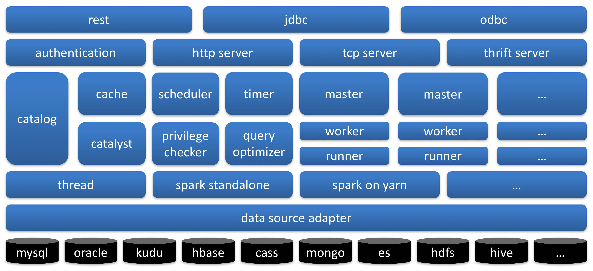

**Moonbox是一个DVtaaS（Data Virtualization as a Service）平台解决方案。**

Moonbox基于数据虚拟化设计思想，致力于提供批量计算服务解决方案。Moonbox负责屏蔽底层数据源的物理和使用细节，为用户带来虚拟数据库般使用体验，用户只需通过统一SQL语言，即可透明实现跨异构数据系统混算和写出。此外Moonbox还提供数据服务、数据管理、数据工具、数据开发等基础支持，可支撑更加敏捷和灵活的数据应用架构和逻辑数仓实践。

## Philosophy

随着大数据技术在企业应用日益广泛，以及越来越多数据系统的出现解决各种不同的场景问题，基于全景数据的快速查询计算成为了迫切的需求和挑战。目前的主流方式是建立以Hadoop为核心的数据仓库/数据湖，某种程度上解决了异构数据系统及数据分散的问题，但依然有数据归集带来的维护成本和时效损失问题。另外数据开发人员也面临着业务频繁变更和结果快速交付的问题。在这样的挑战下，计算服务化、数据虚拟化提供了很好的解决思路。Moonbox正是基于大数据场景的数据虚拟化，计算服务化的一种实践，设计思想主要体现在以下几个方面：

- **计算服务化**

  Moonbox提供多种查询接口以及定时任务，将计算资源变成一种服务，终端用户可以自助注册数据源编写SQL实现需求，只需要关心业务逻辑，而不用关心作业如何提交运行的。

- **数据虚拟化**

  Moonbox提供虚拟表到物理表之间的映射，终端用户无需关心数据的物理存放位置和底层数据源的特性即可操作数据，体验类似操作一个虚拟数据库。

- **统一入口**

  - 统一查询语言

    Moonbox对用户提供统一的SQL语法标准，屏蔽异构数据系统查询语言的差异，用户只需编写SQL即可查询各种数据系统，也可使用SQL进行跨异构数据系统混算，降低多数据系统的学习成本。

  - 统一元数据服务

    Moonbox能够对接多种数据系统，可以拿到各个数据系统数据表的schema信息，Moonbox并不存储schema信息，每次都是实时从数据源获取，所以不存在元数据变更不及时，需要同步更新等问题。Moonbox对外提供统一的元数据服务接口，用户无需为了获取各种数据源的元数据而调用多种接口。

  - 统一权限控制

    每种数据源都有各自特有的安全机制，用户在使用这些数据系统的时候就需要多付出一定的学习成本。Moonbox在逻辑层提供了统一的安全访问机制，在接入时，提供认证登录功能；在查询时，通过拦截分析查询SQL，实现列级别的数据权限控制。如果查询统一从Moonbox接口进入，那么Moonbox就为各种数据源加上了一把安全锁，用户无需再学习各种数据源特有的安全机制。

## Architecture

  

​   Moonbox总体上由四部分组成，分别是客户端、接入层、Grid以及存储计算层。

- **客户端**

  客户端有如下几种：

  - rest api

    以restful api的方式提供batch作业提交、查询作业执行状态、取消作业服务。
  - jdbc

    提供jdbc驱动，可以使用jdbc编程访问, 使用户拥有数据库般的使用体验。
  - odbc

    提供odbc支持，用户可以使用sas连接moonbox进行数据分析。
  - cli

    命令行工具，基于jline实现。通过cli可以完成DDL（Data Definition Language）、DML（Data Manipulation Language）、DCL（Data Control Language）以及Query操作。
  - zeppelin

    提供zeppelin moonbox interpreter，可以使用zeppelin快速进行原型验证和SQL开发。
  - davinci

    通过jdbc支持ABD Stack（敏捷大数据技术栈）中数据可视化平台davinci的接入，进行数据查询并展示。

- **接入层**

  接入层包括http server、tcp server和thrift server，实现客户端接入，并进行用户登录认证。

- **分布式服务层**

  Grid是Moonbox分布式服务层。Grid使用master-slave集群工作模式，支持master主备切换。Grid有Master、Worker、App三种角色：

  - Master负责接收所有的用户请求，根据请求模式（adhoc/batch）将请求调度到合适的App上。
  - Worker向Master注册,负责该节点上App的启动和停止，每个Worker节点可以启动多个不同种类的App。
  - App也会向Master注册,App是真正处理计算的角色,可以是一个Spark App, 也可以是其他自定义的App。

- **计算/存储层**

  Moonbox默认使用Spark作为计算引擎，将一个常驻的Spark作业称之为一个App, 支持standalone和yarn运行模式。Spark App处理用户发过来的请求，包括用户体系管理操作、权限管理操作、SQL解析、下推优化、执行引擎选择等，并提交真正的计算任务。当计算逻辑可以完全下推到数据源计算时，Moonbox将计算任务直接mapping成数据源的查询语言进行下推计算，以减小启动分布式作业的开销。数据源除了可以是hdfs这种纯存储系统，mysql、elasticsearch这种带计算能力的存储系统，还可以是presto等计算引擎，Moonbox将他们统一视为数据源。

## Feature

- **用户体系**

  Moonbox建立了一套完整的用户体系，引入了Organization的概念，用于划分用户空间。系统管理员ROOT账号可以创建多个Organization，并在Organization中指定该Organization的管理者（SA），可以是一个或者多个。SA负责创建管理普通用户。Moonbox将普通用户的能力抽象出六大属性，分别是是否可以执行Account管理语句，是否可以执行DDL语句，是否可以执行DCL语句, 是否拥有可以授权其他用户执行Account类语句的能力，是否拥有可以授权其他用户执行DDL语句的能力，是否拥有可以授权其他用户执行DCL语句的能力。通过属性的自由组合，可以构建出满足多种角色，多种需求的用户体系模型，并可借此实现多租户。

- **扩展SQL**

  Moonbox将查询语言统一为Spark SQL，使用Spark SQL语法进行查询操作，同时扩展了一套DDL、DCL语句。包括对用户的创建删除和授权，数据表或者数据列的访问授权，挂载卸载物理数据源或者数据表，创建删除逻辑数据库，创建删除udf/udaf，创建删除定时任务等。

- **优化策略**

  Moonbox基于Spark进行混算，Spark SQL是支持多数据源的，但是Spark SQL在从数据源中进行数据拉取的时候只进行了project和filter算子的下推，并没有考虑数据源的算力特性，比如elasticsearch对于聚合操作是很友好的，如果聚合操作能下推到elasticsearch中进行计算会比将数据全部拉回Spark计算快的多，比如limit算子如果下推到数据源计算，能大大减少返回的数据量，节省拉取数据和计算的时间。Moonbox对Spark Optimizer优化后的LogicalPlan作进一步的优化，根据规则拆分出可以进行下推的子树，将子树mapping成数据源查询语言，将下推结果拉回Spark参与进一步的计算。如果LogicalPlan可以整体下推计算，那么Moonbox将不采用Spark进行计算，直接使用数据源客户端运行LogicalPlan mapping出来的查询语句，以减少启动分布式作业的开销，并节省分布式计算资源。

- **列权限控制**

  数据安全越来越受到企业的重视，我们希望在方便快捷提供计算服务和数据服务的同时，还希望实现数据的安全。Moonbox定义了DCL语句来实现数据列级别权限控制。Moonbox管理员通过DCL语句将数据表或者数据列授权给用户，Moonbox会将用户和表以及列的权限关系保存到catalog中。当用户在使用SQL查询时会被拦截，分析出SQL被解析后的LogicalPlan中是否引用了未被授权的表或者列，如果有就报错返回给用户。

- **多种形式的UDF/UDAF**

  Moonbox除了支持以jar包的形式创建UDF/UDAF外，还支持以源代码的形式创建，包括Java语言和Scala语言，这给UDF开发验证带来了便捷性。

- **定时任务**

  Moonbox提供了定时作业的功能，用户使用DDL语句定义定时任务，以crontab表达式的形式定义调度策略，后台内嵌quartz进行任务定时调度。

## Document

Please refer to [Moonbox用户手册](https://edp963.github.io/moonbox).  ​

## Latest Release

Please download the latest [RELEASE](https://github.com/edp963/moonbox/releases)

## Help

- **WeChat**：edpstack 

## License

Moonbox is under the Apache 2.0 license. See the [LICENSE](https://github.com/edp963/moonbox/blob/master/LICENSE) file for details.

