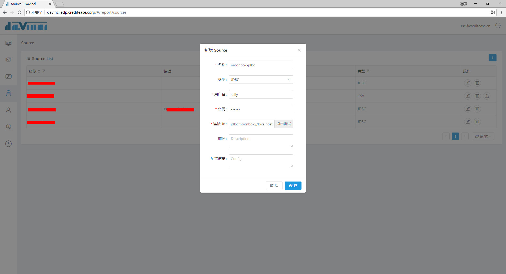

#### 获取jdbc驱动

下载moonbox-jdbc_{{site.SCALA_BINARY_VERSION}}-{{site.MOONBOX_VERSION}}.jar，下载地址：[releases]()

#### 配置
   
1. 将moonbox-jdbc_{{site.SCALA_BINARY_VERSION}}-{{site.MOONBOX_VERSION}}.jar拷贝到Davinci安装目录的lib目录下;
2. 重启Davinci服务;
3. 登录Davinci, 并在Source页面配置Moonbox的JDBC连接信息, 如图所示:

  

请根据实际情况修改上图中的配置项,然后保存。

#### 关于Davinci

更多关于Davinci的内容,请参考[Davinci](https://github.com/edp963/davinci)
