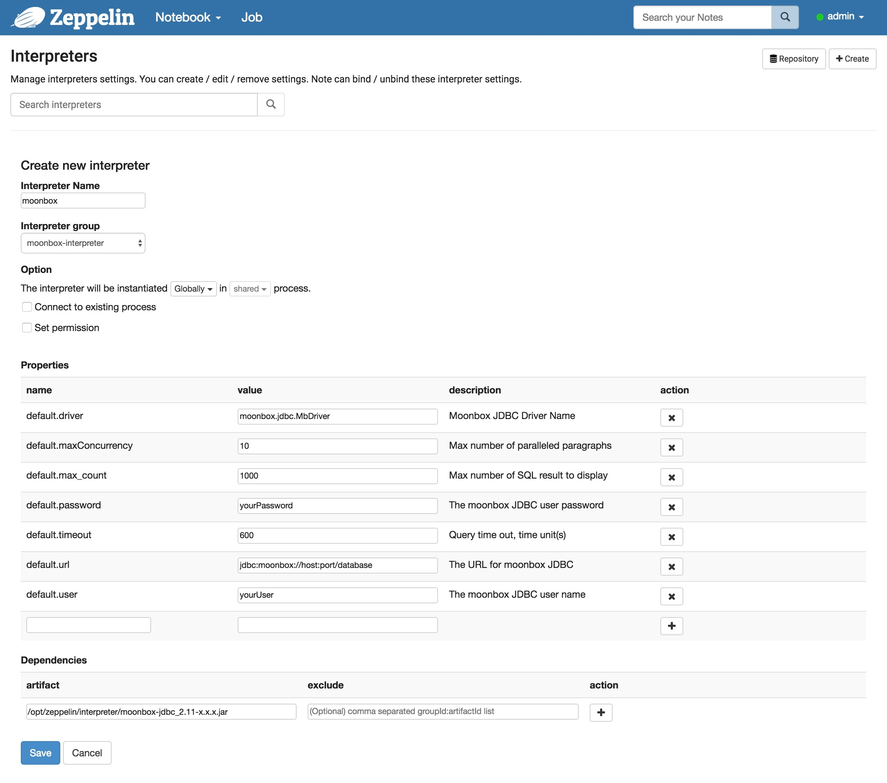

#### 相关jar包获取

- 下载moonbox-jdbc_{{site.SCALA_BINARY_VERSION}}-{{site.MOONBOX_VERSION_SHORT}}.jar [下载地址](https://github.com/edp963/moonbox/releases)
- 下载moonbox-zeppelin-interpreter-{{site.MOONBOX_VERSION_SHORT}}.jar [下载地址](https://github.com/edp963/moonbox/releases)

#### 配置
   
1. 在Zeppelin安装目录的interpreter路径下创建moonbox目录。假设Zeppelin安装目录为/opt/zeppelin。
```
cd /opt/zeppelin/interpreter
mkdir moonbox
```
2. 将moonbox-jdbc_{{site.SCALA_BINARY_VERSION}}-{{site.MOONBOX_VERSION_SHORT}}.jar和moonbox-zeppelin-interpreter-{{site.MOONBOX_VERSION_SHORT}}.jar拷贝到刚才创建的moonbox目录下

3. 重启Zeppelin，创建interpreter。
<p style="text-align: center;">
  
</p>
请根据实际情况修改上图中的配置项,然后保存。

#### 关于Zeppelin

更多关于Zeppelin的内容,请参考[Zeppelin](http://zeppelin.apache.org)