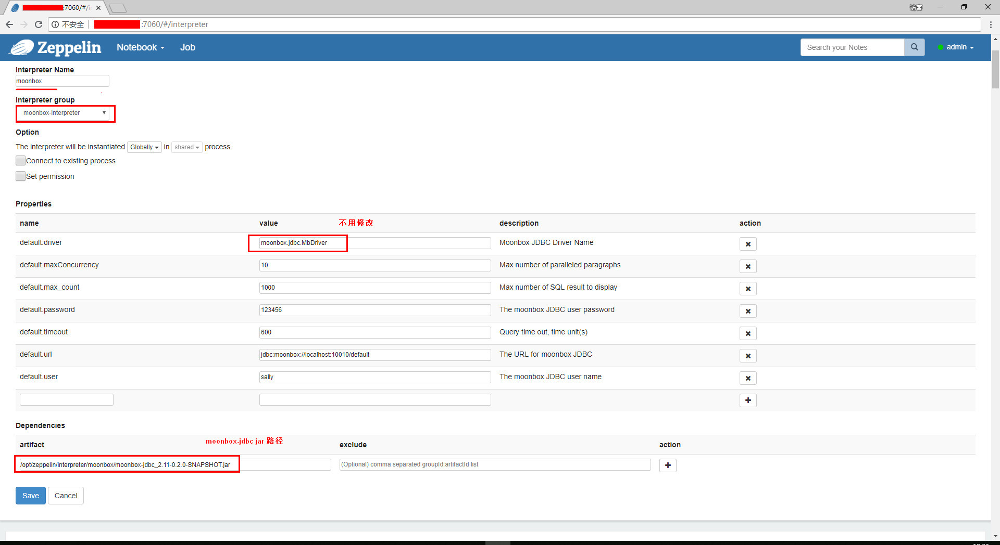
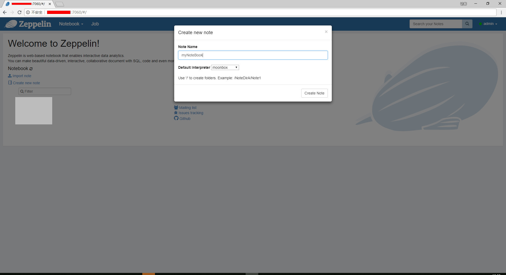

# Moonbox与Zeppelin集成

## Zeppelin

Zeppelin官网地址：[Zeppelin](http://zeppelin.apache.org)

## moonbox-jdbc jar和moonbox-zeppelin-interpreter jar获取

- 下载moonbox-jdbc jar，下载地址：[releases]()
- 下载moonbox-zeppelin-interpreter jar，下载地址：[releases]()

## 配置 
   
1. 在Zeppelin安装目录的interpreter路径下创建moonbox目录
```
cd $ZEEPELIN_HOME/interpreter
mkdir moonbox
```
2. 将moonbox-jdbc jar和moonbox-zeppelin-interpreter jar一起放置于1创建的moonbox目录下

3. 重启Zeppelin，创建interpreter, 命名为moonbox（或其他名字）

   1. URL为：jdbc:moonbox://localhost:10010/default
   2. 10010为JDBC server端口，即moonbox-defaults.conf配置文件中tcp.server.port的值
   3. default为Moonbox中的database名字
4. 创建notebook

5. 查询